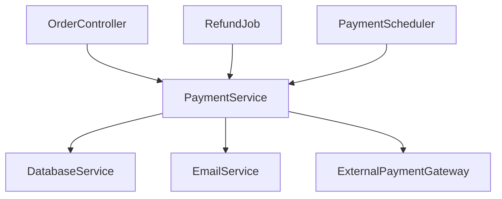

# Architecture Explained — From First Principles to Production

**Audience**: Final year B.Tech student. No prior knowledge assumed.  
**Goal**: Understand how Sourcegraph works, how our project works, and why they're built the way they are.  
**Date**: 2026-08-25

---

## Chapter 0 — Start With a Problem You Already Know

Imagine you join a company on your first day. They hand you a laptop with a Java project that has **200,000 lines of code** across **800 files**. Your task is:

> "Fix the bug in the payment processing module."

You open IntelliJ IDEA. You see a class called `PaymentService`. You see a method called `processPayment()`. You right-click it and select **"Find All References."** In 1 second, IntelliJ shows you every single place in the 800-file codebase that calls this method.

**How did IntelliJ do that in 1 second without reading all 800 files right now?**

That question is the foundation of everything in this document.

---

## Chapter 1 — How a Compiler Reads Code (The Building Blocks)

Before we understand IDEs or Sourcegraph, we need to understand what a compiler actually does when it reads Java code. This is taught in your Compiler Design course, but let's make it concrete.

### Step 1 — Lexing (Turning Text into Tokens)

When you write:

```java
int age = 25;
```

The computer first sees this as a stream of characters:
```
i n t   a g e   =   2 5 ;
```

The **Lexer** groups these into meaningful tokens:
```
[KEYWORD: int]  [IDENTIFIER: age]  [OPERATOR: =]  [NUMBER: 25]  [SEMICOLON: ;]
```

Think of it like the computer learning to read words before understanding sentences.

---

### Step 2 — Parsing (Building the AST)

The **Parser** takes those tokens and builds a tree structure called the **Abstract Syntax Tree (AST)**.

For this method:
```java
public void processPayment(Order order) {
    order.validate();
    database.save(order);
}
```

The AST looks like this in your mind (a tree, not flat text):

```
MethodDeclaration
├── name: processPayment
├── parameters:
│   └── Parameter: Order order
└── body:
    ├── ExpressionStatement
    │   └── MethodCall: order.validate()
    └── ExpressionStatement
        └── MethodCall: database.save(order)
```

**Why a tree?** Because code has a hierarchy. A method contains statements. Statements contain expressions. Expressions contain variables and operators. A tree perfectly represents this nesting.

The AST is like the **skeleton** of your code — the structure, without any "meaning" attached yet.

---

### Step 3 — Semantic Analysis (Building the Symbol Table)

The AST knows the structure. But it doesn't know *what* `order` is. Is it a local variable? A parameter? What type is it? The **Semantic Analysis** phase answers this.

It builds a **Symbol Table** — a big lookup map:

```
Symbol: processPayment
  → Kind: method
  → Defined in: PaymentService.java, line 10
  → Takes parameter: Order (type: Order class)
  → Returns: void

Symbol: order  (inside processPayment)
  → Kind: parameter
  → Type: Order class
  → Scope: inside processPayment only

Symbol: database  (inside PaymentService)
  → Kind: field
  → Type: DatabaseService class
  → Defined in: PaymentService.java, line 5
```

The Symbol Table is like the **index at the back of a textbook** — it tells you exactly where every "word" (symbol) was defined and what it means.

**At this point**, the compiler knows:
- What every variable/method/class IS
- Where it was DEFINED (file + line)
- What TYPE it has
- What SCOPE it lives in

---

### Step 4 — Why This Enables "Go to Definition"

When you click on `database.save(order)` in IntelliJ and press "Go to Definition":

1. IntelliJ finds the node `database` in the AST
2. Looks up `database` in the Symbol Table → finds it's of type `DatabaseService`
3. Looks up `save` method on `DatabaseService` in the Symbol Table → finds it's defined in `DatabaseService.java` line 23
4. Jumps to that file and line

**This is the core insight**: "Go to Definition" and "Find References" are just efficient lookups into a pre-built Symbol Table + a cross-reference map.

The question is: **who builds this table, when, and how do they store it?**

---

## Chapter 2 — The Naive Approach (Why It's Slow)

The simplest approach is: every time you click "Find References", run the compiler right now and build the symbol table from scratch.

**Problem**: For a 200,000 line Java project, this takes 30–60 seconds. Nobody will wait that long to click a button.

**Solution**: Build the Symbol Table **once** in the background, store it somewhere, and serve lookups from that stored version. This is called **pre-indexing**.

This is the core idea behind both IntelliJ's index, Sourcegraph's SCIP, and our project.

---

## Chapter 3 — How IntelliJ Does It

IntelliJ runs a background process when you first open a project. It does a full "index build":

```
Source Files
    ↓ (Lexer + Parser)
AST per file
    ↓ (Semantic Analysis using Eclipse Java Compiler)
Symbol Table
    ↓ (Stored in IntelliJ's internal cache on disk)
~/.IdeaIC2026/system/caches/
```

When you click "Find References":
1. IntelliJ reads the pre-built index from disk
2. Looks up your symbol in microseconds
3. Returns all reference locations instantly

**Why is it fast?** Because the expensive work (compiling, building the symbol table) was done ONCE in the background. The lookup itself is just a database read.

**Problem with IntelliJ's approach**: The index is **private to IntelliJ**. No other tool can read it. An AI agent like Claude Code can't call IntelliJ's index to ask "what calls `processPayment()`?". The index is locked inside one IDE.

---

## Chapter 4 — How Sourcegraph Solved This (The SCIP Protocol)

Sourcegraph is a company that said:

> "What if the Symbol Table was stored in an open, portable format that ANY tool could read — not locked inside one IDE?"

They invented **SCIP** — Source Code Intelligence Protocol.

### The Sourcegraph Architecture (Simple Version)

```
┌─────────────────────────────────────────────────────────────┐
│                  YOUR JAVA REPOSITORY                       │
│  PaymentService.java, OrderService.java, ... (800 files)    │
└──────────────────────────┬──────────────────────────────────┘
                           │
                           ▼
              ┌────────────────────────┐
              │   SCIP Indexer         │
              │   (scip-java)          │
              │                        │
              │   Runs the Java        │
              │   compiler (ECJ) on    │
              │   all your files       │
              │                        │
              │   Extracts:            │
              │   - Every symbol       │
              │   - Every reference    │
              │   - File + line for    │
              │     each one           │
              └────────────┬───────────┘
                           │
                           ▼
              ┌────────────────────────┐
              │   SCIP Index File      │
              │   (index.scip)         │
              │                        │
              │   A single binary file │
              │   in Protobuf format   │
              │   containing ALL       │
              │   symbols + references │
              └────────────┬───────────┘
                           │
                           ▼
              ┌────────────────────────┐
              │   Sourcegraph Server   │
              │   (Cloud or On-prem)   │
              │                        │
              │   Reads the SCIP file  │
              │   Stores it in its     │
              │   own database         │
              │   Serves queries via   │
              │   a web UI or API      │
              └────────────────────────┘
```

### What Goes Into a SCIP Index File?

The SCIP file is essentially a highly efficient version of the Symbol Table. It stores:

**Symbols** (every definition):
```
Symbol: com/example/PaymentService#processPayment().
  → File: src/main/java/com/example/PaymentService.java
  → Line: 10, Column: 17
  → Kind: method
  → Signature: (Order) → void
```

**References** (every usage):
```
Reference to: com/example/PaymentService#processPayment().
  → Found in: OrderController.java, line 45
  → Found in: RefundJob.java, line 22
  → Found in: PaymentScheduler.java, line 88
```

When you click "Find References" in Sourcegraph's web UI, it just looks up the symbol in its database and returns all stored reference locations. Sub-millisecond.

### Why Sourcegraph Uses a Separate Server

Sourcegraph is built for **enterprise teams** with:
- 50+ engineers
- Multiple repositories
- Millions of lines of code

The SCIP file for a huge codebase can be gigabytes. They need a server to:
- Store the index in a proper database
- Serve queries to 50+ people simultaneously
- Handle cross-repository lookups (find usages of a library method across ALL your repos)

**This is powerful but expensive**: Sourcegraph costs $49/user/month. Small teams, solo developers, or AI agents running locally can't use it easily.

---

## Chapter 5 — The Problem Sourcegraph Doesn't Solve

Sourcegraph is great for humans browsing code in a browser. But here's what it doesn't do:

**Scenario**: An AI agent (like Claude Code) is about to edit `processPayment()`. Before it makes the edit, it needs to know: "What else will break if I change this method's signature?"

The agent needs to call a tool that says: *"Here are all 3 callers of processPayment, with their file paths and line numbers."*

Sourcegraph has an API, but:
- It requires you to be running their server (cloud or on-prem)
- It's not designed for the **Model Context Protocol (MCP)** — the standard that AI agents use to call tools
- It's not something you can install locally alongside your project in 5 minutes

**There's a gap**: No lightweight, self-hosted, MCP-native tool that gives AI agents compiler-accurate code intelligence for their local Java project.

That gap is exactly what our project fills.

---

## Chapter 6 — Our Project's Architecture (Explained Simply)

Let's build intuition from the ground up.

### The Big Picture

Our tool is called `impact-index`. Here's what it does at a high level:

```
You have a Java project.
↓
You run: impact-index index ./my-project
↓
impact-index reads ALL your Java files using Spoon (a Java analysis library)
↓
It builds a Symbol Table (like a compiler would)
↓
It stores everything in a SQLite database file (graph.db)
↓
Now, any AI agent can ask: impact-index query "PaymentService.processPayment"
↓
impact-index looks up graph.db and returns: "3 callers: OrderController.java:45, RefundJob.java:22, PaymentScheduler.java:88"
↓
The AI agent now knows exactly what to look at before making changes
```

That's it. Let's go deeper.

---

### Layer 1 — File Discovery (git ls-files)

Before we even read Java files, we need to know **which files exist** in the project.

**Why not just scan the folder?**

Java projects have many files you don't want to index:
- Build output (`target/`, `build/` folders) — compiled `.class` files, not source
- Test fixtures — mock data files, not real code
- Third-party libraries inside the project — you didn't write them

Git already knows exactly which files belong to the project. The command `git ls-files` gives you a clean list of all tracked source files, respecting `.gitignore`.

```
$ git ls-files --include="*.java"

src/main/java/com/example/PaymentService.java
src/main/java/com/example/OrderService.java
src/main/java/com/example/DatabaseService.java
src/test/java/com/example/PaymentServiceTest.java
...
```

We store this list in our SQLite database as a **manifest table**:

```sql
CREATE TABLE files (
  id                   INTEGER PRIMARY KEY,
  path                 TEXT NOT NULL,         -- "src/main/.../PaymentService.java"
  content_hash         TEXT NOT NULL,         -- SHA256 of file content
  last_indexed_commit  TEXT,                  -- "abc1234" (git commit hash)
  status               TEXT DEFAULT 'indexed' -- indexed | stale | excluded
);
```

**Why store the content hash?** Later, when we re-index (Phase 3), we only re-parse files that actually changed. If the hash is the same, the file didn't change — skip it. This is how we make re-indexing fast.

---

### Layer 2 — File Enumeration (Tree-sitter)

After discovery, we need to quickly check each file before doing deep analysis:
- Is it a valid Java file?
- Is it empty?
- Is it so broken/incomplete that it will crash the deep parser?

For this we use **Tree-sitter** — a very fast, error-tolerant parser.

```
Think of Tree-sitter as a speed reader.
It doesn't understand the code deeply.
It just quickly says: "yes, this looks like Java" or "this file is empty/broken."
```

Tree-sitter can parse a file in **microseconds** even if the file has syntax errors (useful for large projects where some files might be partially written). It handles the **file enumeration phase** — cheap, fast, resilient.

---

### Layer 3 — Semantic Extraction (Spoon)

This is the heart of the system. This is where we actually *understand* the code.

**Spoon** is a Java library built on top of the **Eclipse Compiler for Java (ECJ)**. The same ECJ that powers:
- Eclipse IDE
- SonarQube
- IntelliJ's Java type checking

When Spoon processes a file, it does the full compilation pipeline internally:

```
Java Source File
    ↓ Lexer
Tokens
    ↓ Parser
AST (Abstract Syntax Tree)
    ↓ Semantic Analysis (ECJ)
Fully resolved AST — every variable has its type,
every method call is resolved to its exact declaration,
every class knows its full inheritance chain
```

Let's see what Spoon can tell us about this code:

```java
// OrderController.java
public class OrderController {
    @Autowired
    private PaymentService paymentService;

    public void handleOrder(Order order) {
        paymentService.processPayment(order);  // ← Spoon knows this
    }
}
```

From this file, Spoon extracts:

**Symbol**: `OrderController.handleOrder`
- Kind: method
- Defined in: OrderController.java, line 6
- Returns: void

**Edge** (relationship):
- `OrderController.handleOrder` **calls** `PaymentService.processPayment`
- Located at: OrderController.java, line 7

This is the key difference between Spoon and simple text search:
- Text search (grep) would just find the word "processPayment" anywhere in the file
- Spoon resolves it to the **exact method** on the **exact class** `PaymentService`
- If there were another class also called `processPayment`, Spoon would correctly distinguish them

---

### Layer 4 — The Graph Store (SQLite)

We store everything Spoon extracts into a SQLite database. SQLite is a file-based database — no server needed. The entire database lives in one file: `graph.db`.

**Why SQLite?** Because:
- Zero installation — it's just a file
- Fast enough for a single project
- Easy to inspect (you can open it with any SQLite viewer)
- Used by WhatsApp, Firefox, iPhone — battle-tested

**Our database has 4 tables:**

```sql
-- Table 1: FILES — what we've indexed
CREATE TABLE files (
  id                  INTEGER PRIMARY KEY,
  path                TEXT NOT NULL,
  content_hash        TEXT,
  last_indexed_commit TEXT,
  status              TEXT DEFAULT 'indexed'
);

-- Table 2: SYMBOLS — every class, method, variable we found
CREATE TABLE symbols (
  id    INTEGER PRIMARY KEY,
  name  TEXT NOT NULL,      -- "processPayment"
  fqn   TEXT NOT NULL,      -- "com.example.PaymentService.processPayment"
  kind  TEXT NOT NULL,      -- "method" | "class" | "field" | "interface"
  file  TEXT NOT NULL,      -- "src/.../PaymentService.java"
  line  INTEGER NOT NULL    -- 10
);

-- Table 3: EDGES — relationships between symbols
CREATE TABLE edges (
  id          INTEGER PRIMARY KEY,
  from_symbol INTEGER REFERENCES symbols(id),  -- who is doing the calling?
  to_symbol   INTEGER REFERENCES symbols(id),  -- who is being called?
  edge_type   TEXT NOT NULL,  -- "calls" | "reads" | "writes" | "imports"
  file        TEXT NOT NULL,  -- where does this relationship happen?
  line        INTEGER NOT NULL
);

-- Table 4: QUALITY METRICS — code quality data
CREATE TABLE quality_metrics (
  symbol_id   INTEGER REFERENCES symbols(id),
  metric_name TEXT,   -- "cyclomatic_complexity" | "test_coverage"
  value       REAL,
  source      TEXT    -- "spoon" | "jacoco" | "surefire"
);
```

**A concrete example of what's stored:**

```
symbols table:
  id=1  name="processPayment"  fqn="com.example.PaymentService.processPayment"  kind="method"  file="PaymentService.java"  line=10
  id=2  name="handleOrder"     fqn="com.example.OrderController.handleOrder"    kind="method"  file="OrderController.java"  line=6

edges table:
  from_symbol=2  to_symbol=1  edge_type="calls"  file="OrderController.java"  line=7
```

When an AI agent queries: *"What calls processPayment?"*
```sql
SELECT s.fqn, e.file, e.line
FROM edges e
JOIN symbols s ON e.from_symbol = s.id
WHERE e.to_symbol = (SELECT id FROM symbols WHERE fqn = 'com.example.PaymentService.processPayment')
  AND e.edge_type = 'calls';
```

Result returned in milliseconds:
```
OrderController.handleOrder → OrderController.java:7
RefundJob.processRefund     → RefundJob.java:22
PaymentScheduler.run        → PaymentScheduler.java:88
```

---

### Layer 5 — The Query API (CLI + MCP Server)

We expose the graph through two interfaces:

**CLI** (for developers, for testing):
```bash
$ impact-index query "PaymentService.processPayment"

Symbol: com.example.PaymentService.processPayment
  Defined at: src/main/java/com/example/PaymentService.java:10

Callers (3):
  → OrderController.handleOrder       OrderController.java:7
  → RefundJob.processRefund           RefundJob.java:22
  → PaymentScheduler.run              PaymentScheduler.java:88

Quality:
  Cyclomatic Complexity: 4 (moderate)
  Test Coverage: 87%
```

**MCP Server** (for AI agents — the key innovation):

The MCP server wraps the same CLI logic but speaks the **Model Context Protocol** — the standard language that AI agents use to discover and call tools.

When Claude Code, Cursor, or any MCP-compatible agent starts working on your project, it:
1. Discovers our MCP server (listed in the project's `.mcp.json` config)
2. Sees available tools: `index`, `query`, `lint`, `catalog`
3. Before editing any file, automatically calls `query` to understand impact
4. Uses the result to make safer, more informed edits

```
┌─────────────────────────────────────────┐
│           Claude Code (AI Agent)        │
│                                         │
│  "I need to change processPayment.      │
│   Let me check what calls it first."    │
│                                         │
│  → calls: impact-index.query(           │
│      "PaymentService.processPayment"    │
│    )                                    │
└────────────────┬────────────────────────┘
                 │ MCP protocol
                 ▼
┌─────────────────────────────────────────┐
│        Our MCP Server                   │
│        (impact-index)                   │
│                                         │
│  → queries graph.db                     │
│  → returns: 3 callers with file:line    │
└────────────────┬────────────────────────┘
                 │
                 ▼
┌─────────────────────────────────────────┐
│           Claude Code (AI Agent)        │
│                                         │
│  "OK, 3 places call this method.        │
│   I need to update all 3 after          │
│   changing the signature."              │
└─────────────────────────────────────────┘
```

---

### Layer 6 — The Doc Generator (Phase 2)

Once we have the graph (symbols + edges), we can generate **human-readable documentation** from it.

For each Java package, we generate a `docs/modules/service.md`:

```markdown
# Package: com.example.service

## Overview
This package contains 5 classes and 89 methods.
It is the most referenced package in the codebase (312 inbound edges).

## Classes

### PaymentService (most referenced — 47 inbound edges)
Core payment processing logic. Responsible for validating and processing
orders through the payment gateway.

**Key methods:**
- `processPayment(Order)` — called by 3 classes
- `validateCard(CardDetails)` — called by 1 class
- `refund(Order, amount)` — called by 2 classes

**Dependencies:**
- DatabaseService (writes orders)
- ExternalPaymentGateway (HTTP calls — not in index)
- EmailService (sends receipts)
```

And a visual architecture diagram (`docs/architecture.md`):



This diagram is generated from the edges table — it's not written by hand. Every arrow comes from an actual method call we detected.

---

## Chapter 7 — Sourcegraph vs Our Project: Side by Side

| Dimension | Sourcegraph | Our Project (impact-index) |
|---|---|---|
| **Who is it for?** | Enterprise teams (50+ engineers, multiple repos) | Single projects, AI agents, individual developers |
| **How is it accessed?** | Web browser or cloud API | Local CLI + MCP server |
| **Where does it run?** | Their cloud server (or expensive on-prem) | On your own machine, alongside your project |
| **Index format** | SCIP (Protobuf binary) | SQLite database (human-readable) |
| **Java analysis** | `scip-java` (uses Gradle/Maven build) | Spoon (ECJ-backed, same accuracy) |
| **AI agent integration** | Not MCP-native | Built for MCP from day one |
| **Cost** | $49/user/month | Free (open source) |
| **Cross-repo lookup** | ✅ Yes (their main feature) | ❌ No (v1 is single project) |
| **Offline / local** | ❌ Requires network | ✅ Fully local |
| **Human docs generation** | ❌ No | ✅ Yes (Phase 2) |
| **Quality metrics** | ❌ No | ✅ Yes (complexity, coverage) |
| **Lint / health check** | ❌ No | ✅ Yes (`impact-index lint`) |

**Both use the same core idea**: pre-build a symbol + reference graph from the Java compiler, store it, serve lookups fast.

**The difference is in the target user and delivery mechanism.** Sourcegraph is a $2.6B enterprise product. Ours is a lightweight, portable, MCP-native tool designed to sit in the AI agent orchestration layer.

---

## Chapter 8 — The Full System Diagram

Here is the complete architecture of our project in one picture:

```
┌─────────────────────────────────────────────────────────────────────────┐
│                         YOUR JAVA PROJECT                               │
│  800 Java files, Maven build, Git repository                            │
└───────────────────────────────┬─────────────────────────────────────────┘
                                │
                    ┌───────────▼───────────┐
                    │  PHASE 1: DISCOVERY   │
                    │  git ls-files         │
                    │  → files manifest     │
                    │    in SQLite          │
                    └───────────┬───────────┘
                                │
                    ┌───────────▼───────────┐
                    │  PHASE 2: ENUMERATE   │
                    │  Tree-sitter          │
                    │  → fast validity      │
                    │    check per file     │
                    └───────────┬───────────┘
                                │
                    ┌───────────▼───────────┐
                    │  PHASE 3: EXTRACT     │
                    │  Spoon (ECJ)          │
                    │  → AST per file       │
                    │  → semantic analysis  │
                    │  → symbols + edges    │
                    │  → complexity metrics │
                    └───────────┬───────────┘
                                │
              ┌─────────────────▼─────────────────┐
              │         GRAPH STORE               │
              │         graph.db (SQLite)          │
              │                                   │
              │  files | symbols | edges           │
              │  quality_metrics                  │
              └──────────┬──────┬─────────────────┘
                         │      │
          ┌──────────────▼──┐  ┌▼──────────────────────────┐
          │  QUERY API      │  │  DOC GENERATOR             │
          │  CLI + MCP      │  │                            │
          │  Server         │  │  docs/                     │
          │                 │  │  ├── index.md (catalog)    │
          │  query <symbol> │  │  ├── index-log.md (log)    │
          │  lint           │  │  ├── architecture.md       │
          │  catalog        │  │  ├── modules/*.md          │
          │  index          │  │  └── known-limitations.md  │
          └────────┬────────┘  └────────────────────────────┘
                   │
     ┌─────────────┼─────────────────────────────┐
     │             │                             │
     ▼             ▼                             ▼
┌─────────┐  ┌───────────┐               ┌─────────────┐
│ Claude  │  │  Cursor   │               │  IntelliJ   │
│ Code    │  │  / Copilot│               │  Plugin     │
│ (Agent) │  │  (IDE)    │               │ (Phase 4)   │
└─────────┘  └───────────┘               └─────────────┘
    Any MCP-compatible tool can call our server
```

---

## Chapter 9 — Why This is Hard (and What Makes It Interesting)

If this was easy, every developer would have already built it. Here's where the real engineering challenges are:

### Challenge 1: Java is complex

Java has generics, interfaces, abstract classes, annotation processors, Spring DI, reflection. A simple grep will completely miss:

```java
// This calls PaymentService.processPayment — but grep won't find it
@Autowired
PaymentService service;  // Spring injects this at runtime

service.processPayment(order);  // ← grep for "processPayment" finds this
                                // but doesn't know "service" is PaymentService
```

Spoon resolves this correctly because it reads the Spring annotations and the type system. This is why we need a compiler-grade tool, not just text search.

### Challenge 2: The index gets stale

The moment a developer edits a file, the graph is out of date. If the index says "3 callers" but someone just added a 4th, an AI agent gets wrong information.

Solution: the manifest table + `git diff`-based incremental re-indexing. Only re-parse files that changed since the last indexed commit. This is Phase 3.

### Challenge 3: Some things can't be statically analyzed

```java
// This is dynamic — we cannot know at index time
String className = getClassNameFromDatabase();
Class<?> clazz = Class.forName(className);
clazz.getMethod("processPayment").invoke(instance, order);
```

This calls `processPayment` via Java Reflection — impossible to detect without actually running the program. We document these as "known limitations."

### Challenge 4: Performance

Spoon/ECJ is thorough but not instant. For a 200k-line project, a full index can take 30-60 seconds. To make this practical:
- Run Spoon as a **persistent daemon** (started once, kept alive) so the JVM startup cost is paid only once
- Use incremental re-indexing so only changed files are re-processed
- Serve all queries from the pre-built SQLite index (sub-millisecond)

---

## Chapter 10 — Summary in Simple Words

**What does a compiler do?**
- Reads code → builds a symbol table (a map of what everything is and where it's defined)

**What does IntelliJ do?**
- Pre-builds this symbol table in the background
- Stores it in its private cache
- Uses it to power "Go to Definition" and "Find References" instantly

**What does Sourcegraph do?**
- Same idea, but stores it in an open format (SCIP) on their cloud server
- Multiple engineers can all query the same index
- Powers a web browser interface for code search + navigation

**What does our project do?**
- Same idea as Sourcegraph, but:
  - Runs locally on your machine (no cloud, no server)
  - Stores in SQLite (simple, portable, zero setup)
  - Exposes via MCP so AI agents can call it directly
  - Also generates human-readable docs from the same graph
  - Has a `lint` command to check graph health
  - Has a `catalog` command for AI agent onboarding
  - Targeted at AI-assisted development, not human browsing

**The one-sentence pitch:**
> "impact-index is a self-hosted, MCP-native code intelligence layer for Java projects — it gives any AI agent the same reference resolution accuracy as IntelliJ, without being locked inside any IDE."

---

*Saved to: `docs/architecture-explained.md`*  
*Next read: `docs/design-discussion.md` for the open decisions*  
*Session state: `docs/session-log.md`*
